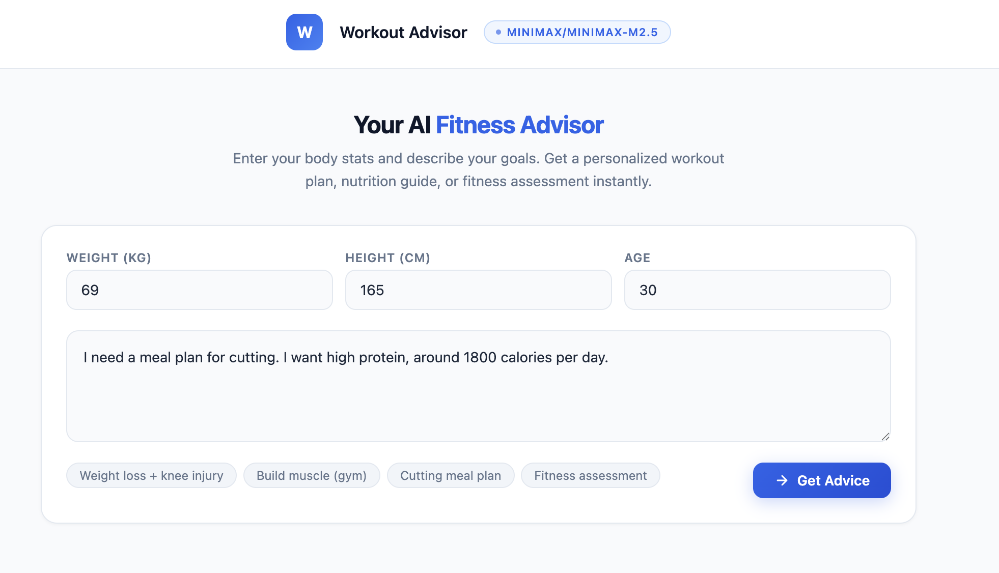

# Workout Advisor

Aplikasi web AI yang memberikan rekomendasi fitness, latihan dan nutrisi secara personal berdasarkan profil fisik (berat badan, tinggi badan, usia, BMI) dan tujuan.

## Fitur

- **Workout Plan** — rencana latihan mingguan lengkap dengan daftar exercise, set, dan reps
- **Nutrition Plan** — target kalori, breakdown makro, dan contoh meal plan harian
- **Fitness Assessment** — analisis kondisi fisik berdasarkan BMI dan data pengguna
- **General Knowledge** — jawaban pertanyaan umum seputar fitness dan nutrisi
- **Deteksi Bahasa** — otomatis merespons dalam Bahasa Indonesia atau English

## Tech Stack

- **Backend:** FastAPI + Uvicorn
- **Template:** Jinja2
- **AI:** OpenRouter API (MiniMax M2.5)
- **Package Manager:** uv
- **Validation:** Pydantic (structured output)

## Struktur Proyek

```
app/
├── main.py                          # Entry point FastAPI
├── utils/
│   ├── openai.py                    # OpenRouter client
│   └── tools.py                     # Fungsi hitung BMI
└── modules/
    └── workoutAdvisor/
        ├── router.py                # Route handler + Pydantic schema
        └── prompt.py                # System prompt AI
templates/
└── index.html                       # UI (Jinja2 template)
```

## Cara Menjalankan

### 1. Clone repository

```bash
git clone <repo-url>
cd workout-advisor
```

### 2. Install dependencies

Cek sini untuk setup [uv](https://docs.astral.sh/uv/):

```bash
uv sync
```

### 3. Setup environment variable

Buat file `.env` di root project:

```
OPENROUTER_API_KEY=sk-or-v1-xxxxxxxxxxxxx
```

Dapatkan API key dari [openrouter.ai](https://openrouter.ai/).

### 4. Jalankan server

```bash
make dev
```

Atau manual:

```bash
uv run uvicorn app.main:app --reload
```

Buka [http://localhost:8000](http://localhost:8000) di browser.

## Cara Pakai



1. Masukkan berat badan (kg), tinggi badan (cm), dan usia
2. Tulis tujuan dan keterbatasan, atau keluhan di kolom teks (atau klik contoh prompt yang tersedia)
3. Klik **Get Advice**
4. Kita akan mmemberikan respons yang sesuai untuk kamu! (workout plan, nutrition plan, assessment, atau sekedar general knowledge mengenai tips kesehatan)
